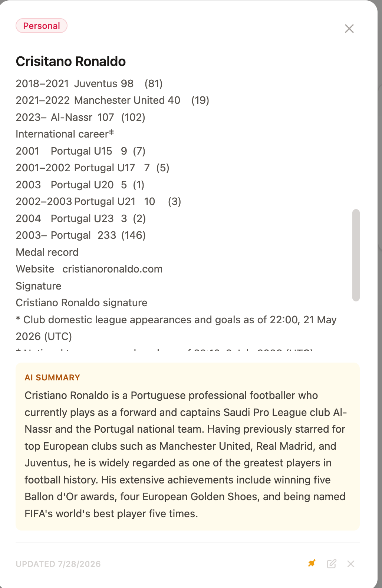
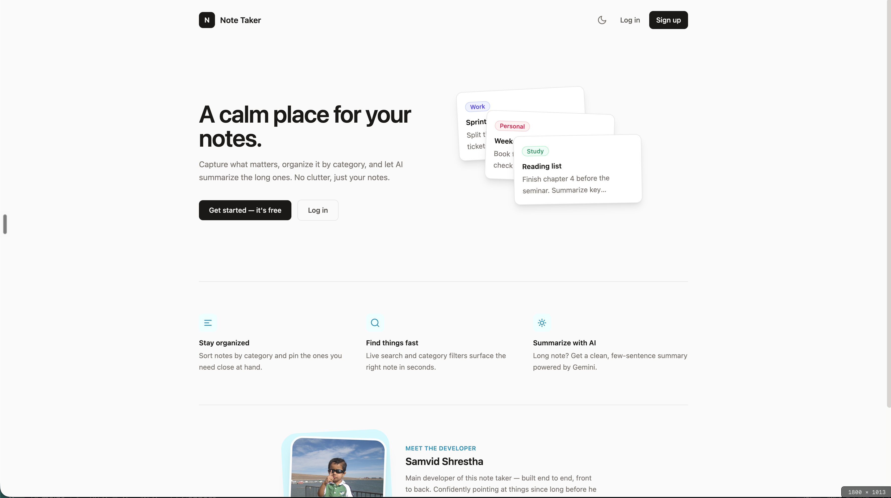
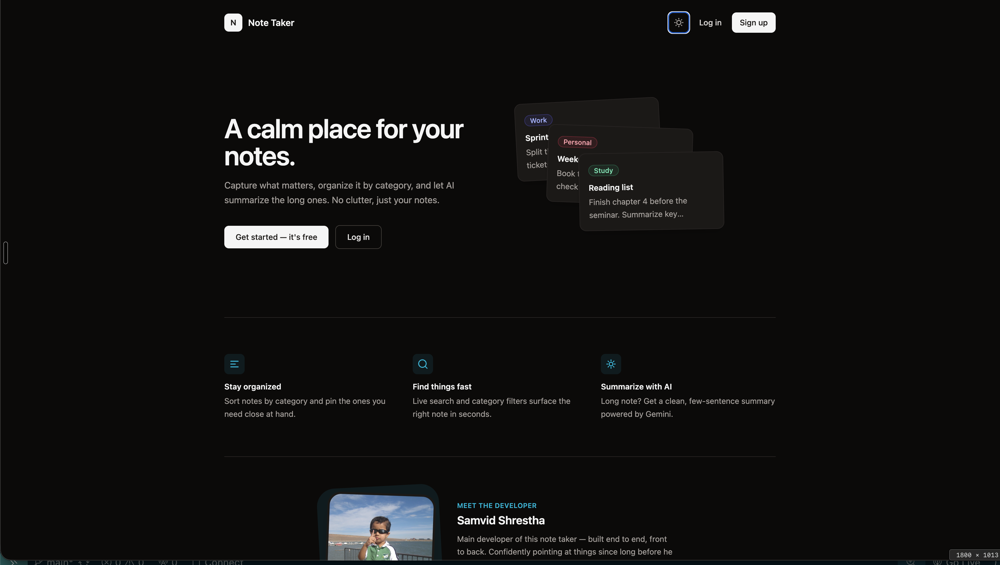

# Note Taker

Note Taker is a calm, simple place to write things down. You sign up, create notes, sort them into categories, pin the ones you care about, and search through everything instantly. When a note gets long, you can ask it to summarize itself using AI so you do not have to reread a wall of text just to remember the point.

## What it does

Once you log in you land on your notes page, where you can add a note, give it a title and a category, and pin it if it matters. Categories let you keep work, personal, and study notes apart instead of scrolling through one long mess. Search works live as you type, and it looks across titles, content, and categories at once so you rarely have to scroll to find something. If a note is too long to skim, opening it shows a "Summarize with AI" option that uses Gemini to condense it into a few clean sentences.

The app also has a public homepage for people who are not logged in yet, so they get a sense of what the app does before signing up, along with a short section about the developer. Dark mode and light mode are supported everywhere, including the login and signup screens, and the choice is remembered.

Account recovery is handled through email. If you forget your password, you request a reset link, and it sends a single use token that expires in an hour so old links cannot be reused.

## AI in this project

Two different AI assistants were used while building this project, in two different ways.

Claude was used as a coding assistant throughout development, for example helping write and refactor backend routes, debug the email flow, and clean up commit history.

Gemini is used inside the running app itself, as a real feature. When a user opens a note and clicks "Summarize with AI," the backend sends the note content to Gemini and returns a short summary to the user. This is not a development tool, it is a feature the end user directly interacts with.

Below are a few screenshots showing what the app looks like and the AI summary feature in action.

### Homepage, light mode

### Homepage, dark mode

### AI summary inside a note

In the example above, a long note containing a footballer's career statistics is condensed by Gemini into a short, readable summary right inside the note popup.

## Tech stack

The frontend is built with React and Vite, styled with Tailwind CSS, and uses React Router for navigation and Axios for talking to the backend. The backend runs on Express and Node, uses MongoDB with Mongoose for storage, express validator for request validation, and JWT for authentication. Password reset emails are sent through Resend, and note summaries are generated through Google's Gemini API.

## Running it locally

Clone the repository and install dependencies separately for the backend and frontend, since they are two independent apps.

For the backend, move into the backend folder, run npm install, create a .env file with your MongoDB connection string, a JWT secret, your Resend API key, your Gemini API key, and your CORS origin, then run npm start.

For the frontend, move into the frontend folder, run npm install, then run npm run dev to start the Vite dev server.

## Deployment

The frontend is deployed on Netlify and the backend is deployed on Render, configured through the render.yaml file at the root of this repository. The GitHub repository for this project is at github.com/ssamvid/NoteTaker.
